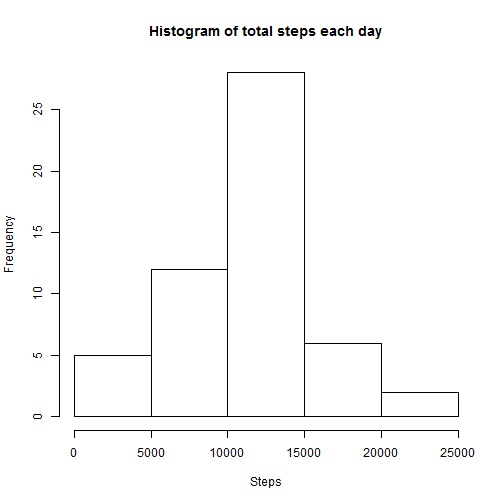
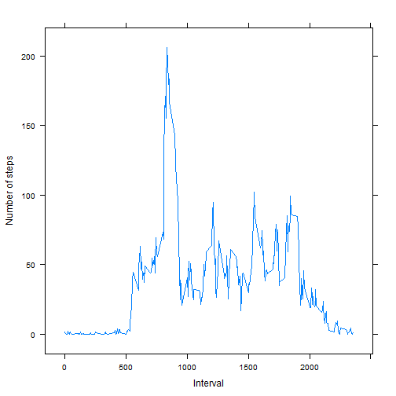
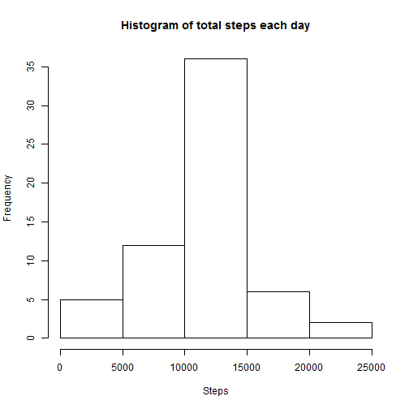

## Loading and preprocessing the data
First of all, we will load the data.   


```r
Sys.setlocale("LC_TIME", "English")
```

```
## [1] "English_United States.1252"
```

```r
unzip("activity.zip")
data<-read.csv("activity.csv")
```


## What is mean total number of steps taken per day?

First, we calculated the total number of steps per day: 


```r
table<-aggregate(steps ~ date, data=data, FUN=sum,na.action = na.omit)
```

To have an overview of the distribution of the number of steps, a histogram is made as below:  


```r
hist(table$steps,ylab="Frequency",xlab="Steps",main="Histogram of total steps each day")
```

 

Then we calculate the mean and median of total number of steps taken per day:   


```r
mean(table$steps)
```

```
## [1] 10766.19
```

```r
median(table$steps)
```

```
## [1] 10765
```

## What is the average daily activity pattern?

First, we calculated the average number of steps taken, averaged across all days as below:     


```r
table2<-aggregate(steps ~ interval, data=data, FUN=mean,na.action = na.omit)
```

A time series plot is made as below:  


```r
library(lattice)
xyplot(table2$steps ~ table2$interval, type="l" ,xlab="Interval",ylab="Number of steps")
```

 

We can also check which 5-minute interval, on average across all the days in the dataset, contains the maximum number of steps:  


```r
table2[table2$steps==max(table2$steps),]$interval
```

```
## [1] 835
```


## Imputing missing values

The presence of missing days may introduce bias into some calculations or summaries of the data. The total number of missing values in the dataset is calculated as below:   


```r
sum(!complete.cases(data))
```

```
## [1] 2304
```

To better calculate the daily activity pattern, we replace these NA values with the mean for that 5-minute interval, and create a new dataset:  


```r
data_new<-data
for (i in 1:nrow(data_new)){
        if (is.na(data_new[i,1])) {
        interval=data_new[i,3]
        data_new[i,1]=table2[table2$interval==interval,]$steps
        }
}
```

Then we can make a histogram of the total number of steps taken each day from this new table as below:  


```r
table_new<-aggregate(steps ~ date, data=data_new, FUN=sum)
hist(table_new$steps,ylab="Frequency",xlab="Steps",main="Histogram of total steps each day")
```

 

And we calculate the mean and median of total number of steps taken per day from the new table:   


```r
mean(table_new$steps)
```

```
## [1] 10766.19
```

```r
median(table_new$steps)
```

```
## [1] 10766.19
```

We can see that the mean does not differ from the original data, since we replaced the NA values with the mean, while the median changed.

## Are there differences in activity patterns between weekdays and weekends?

First of all, we will create a new factor variable in the new dataset with two levels "weekday"" and "weekend"" indicating whether a given date is a weekday or weekend day.  


```r
data_new$date<-strptime(data_new$date,"%Y-%m-%d")
data_new$weekday<-weekdays(data_new$date)
data_new$factor<-"weekday"
data_new$factor <- ifelse(data_new$weekday == "Saturday" |data_new$weekday == "Sunday","weekend", data_new$factor)
```

Then we make a panel plot containing a time series plot of the 5-minute interval (x-axis) and the average number of steps taken, averaged across all weekday days or weekend days (y-axis) as below:  


```r
data_new_weekday<-data_new[data_new$factor=="weekday",]
data_new_weekend<-data_new[data_new$factor=="weekend",]
table_new_weekday<-aggregate(steps ~ interval, data=data_new_weekday, FUN=mean)
table_new_weekend<-aggregate(steps ~ interval, data=data_new_weekend, FUN=mean)
table_new_weekday$factor="weekday"
table_new_weekend$factor="weekend"
table_new_final<-rbind(table_new_weekday,table_new_weekend)
xyplot(table_new_final$steps ~ table_new_final$interval|table_new_final$factor,type="l" , layout = c(1, 2),xlab="Interval",ylab="Number of steps") 
```

 
